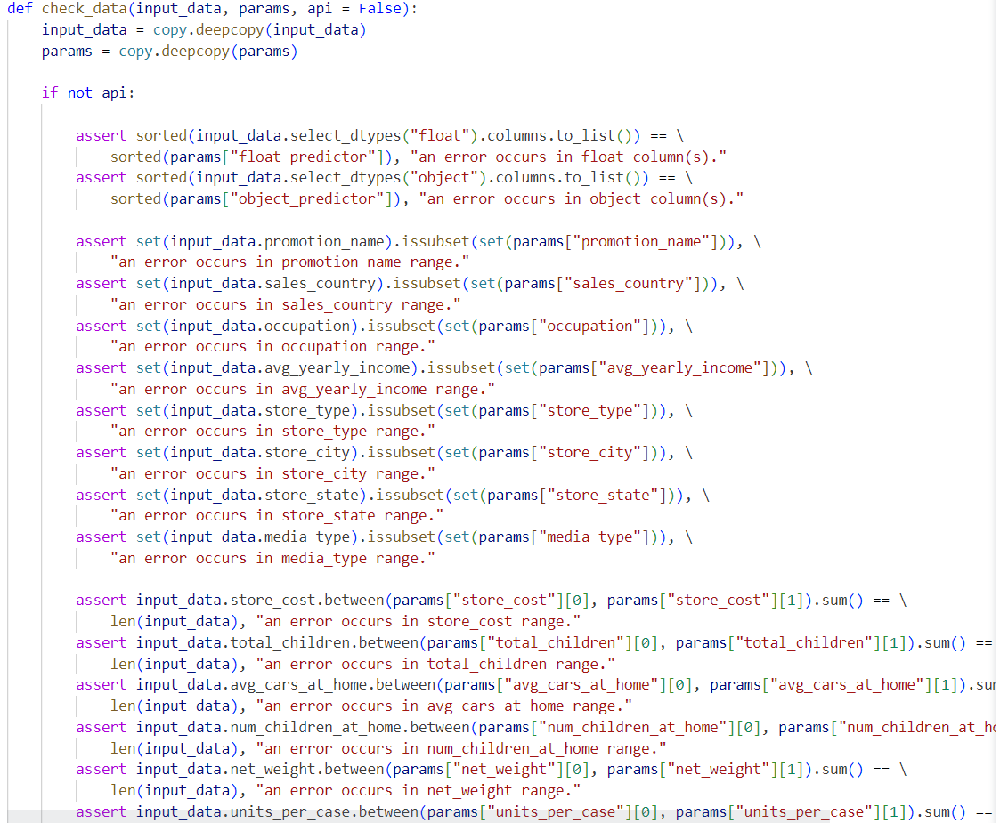
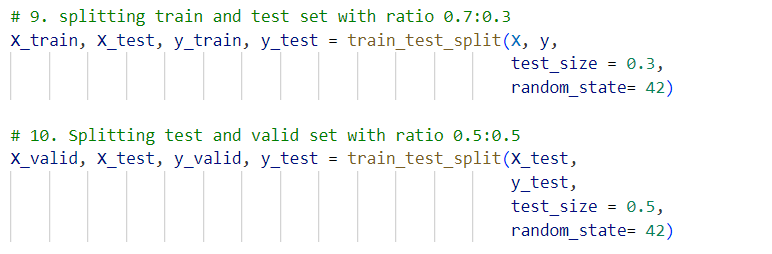
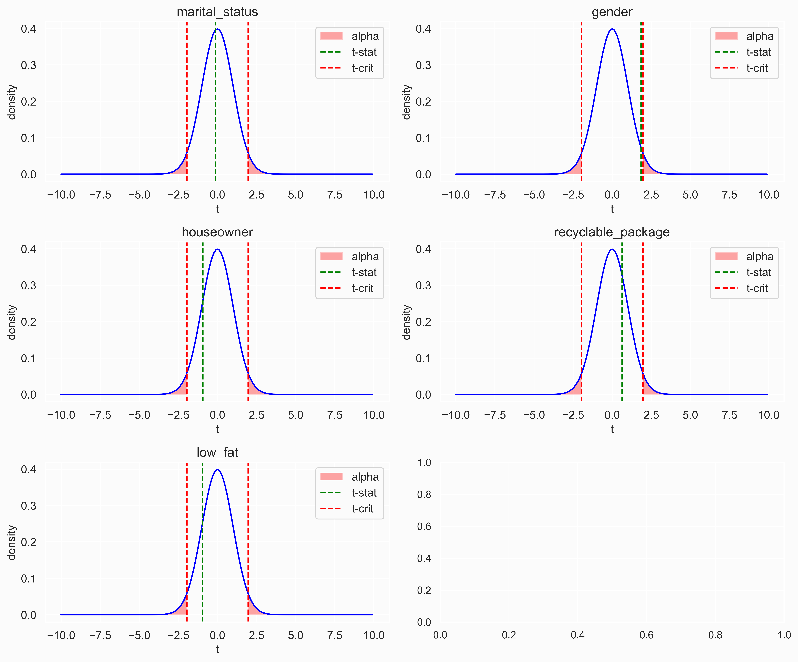
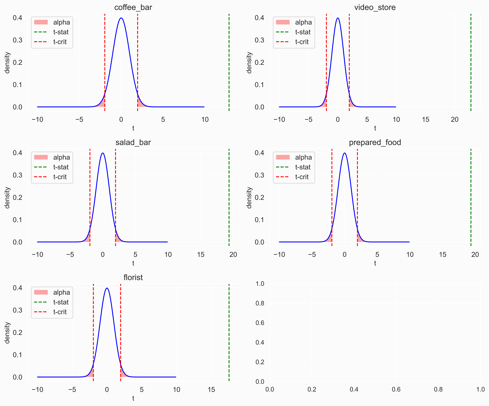
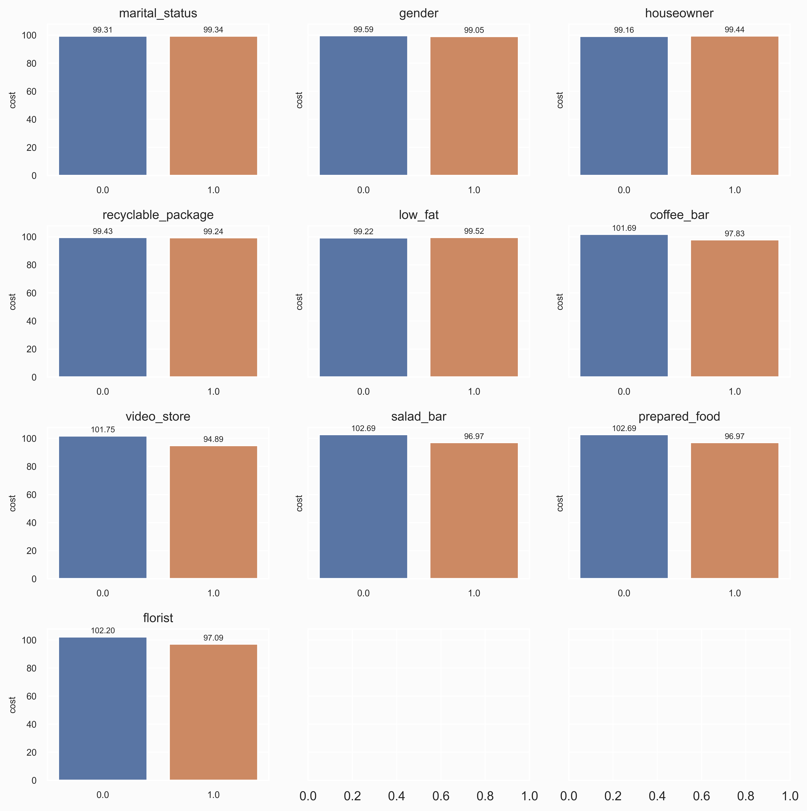
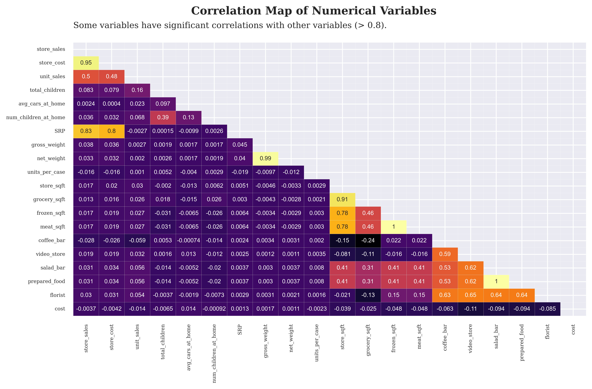
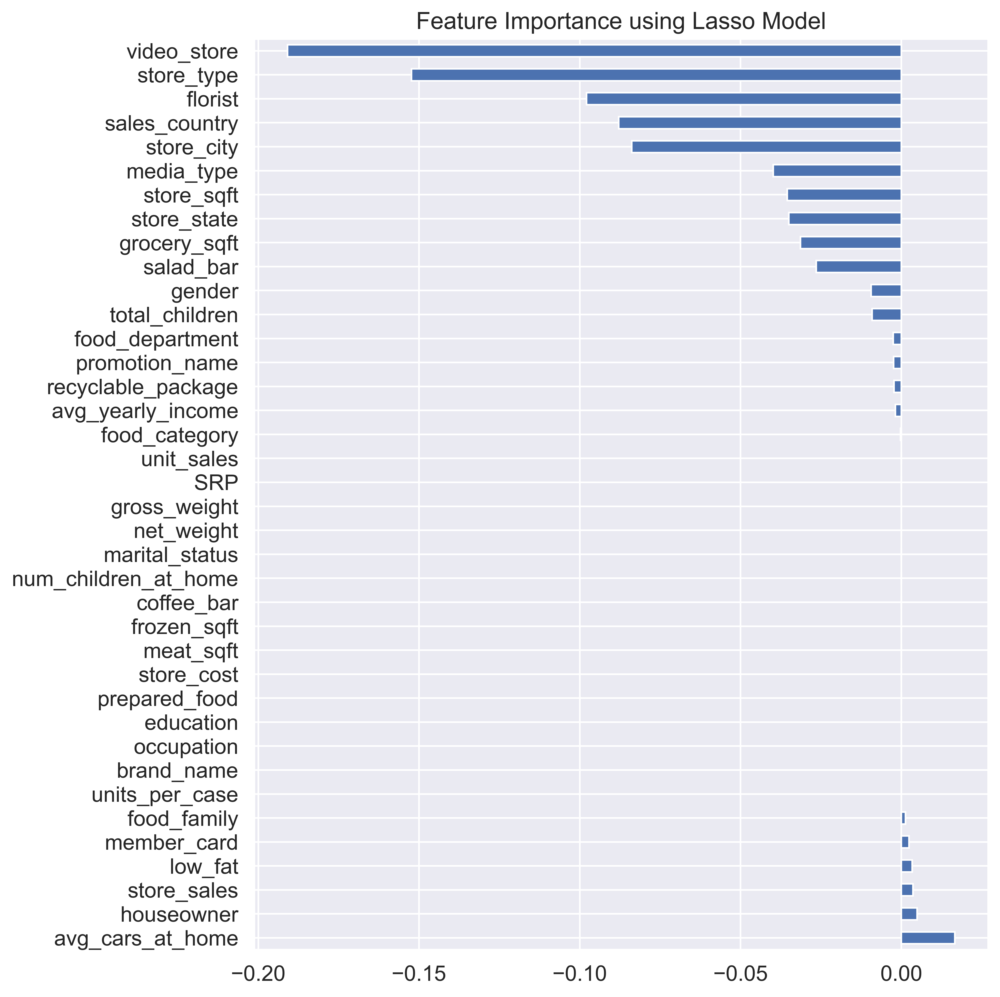
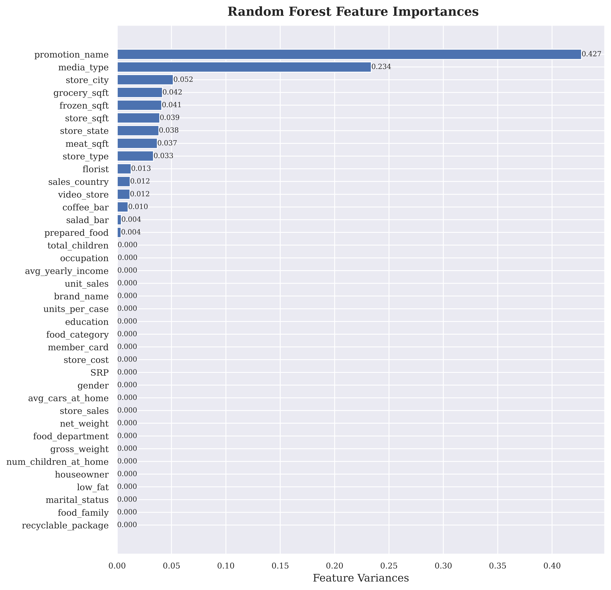
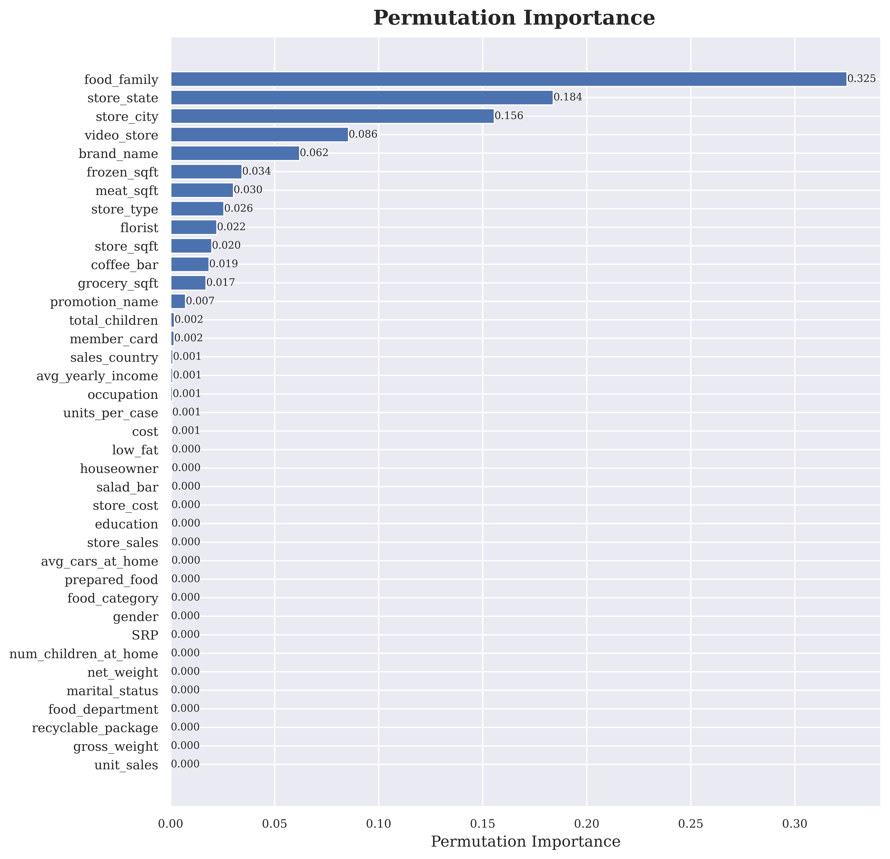
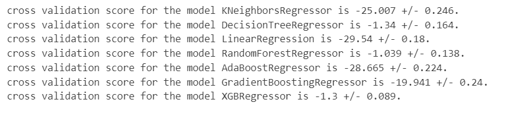

# Regression Model - Customer Acquisition Cost - A Feature Selection Approach
----

<a name="readme-top"></a>

<!-- TABLE OF CONTENTS -->
<details>
  <summary>Table of Contents</summary>
  <ol>
    <li><a href="#about-the-project">About The Project</a></li>
    <li><a href="#business-objective">Business Objective</a></li>
    <li><a href="#business-metrics">Business Metrics</a></li>
    <li><a href="#getting-started">Getting Started</a></li>
    <li>
      <a href="#data-workflow">Data Workflow</a>
      <ul>
        <li><a href="#data-preparation">Data Preparation</a></li>
        <li>
          <a href="#eda-and-feature-selection">EDA and Feature Selection</a>
          <ul>
            <li><a href="#1-statistical-inference-univariate-analysis">1. Statistical Inference (Univariate Analysis)</a></li>
            <li>
              <a href="#2-parametric-assumption">2. Parametric Assumption</a>
              <ul>
                <li><a href="#21-normality">2.1 Normality</a></li>
                <li><a href="#22-homogenity-of-variance">2.2 Homogeneity of Variance</a></li>
              </ul>
            </li>
            <li><a href="#3-one-way-anova-test">3. One-Way ANOVA Test</a></li>
            <li>
              <a href="#4-two-group-t-test-or-welchs-test">4. Two-Group (T-Test or Welch's Test)</a>
              <ul>
                <li><a href="#41-independence-t-test">4.1 Independence T-Test</a></li>
                <li><a href="#42-welchs-test">4.2 Welch's Test</a></li>
              </ul>
            </li>
          </ul>
        </li>
        <li>
          <a href="#data-preprocessing-and-feature-engineering">Data Preprocessing and Feature Engineering</a>
          <ul>
            <li><a href="#1-imputing">1. Imputing</a></li>
            <li><a href="#2-encoding">2. Encoding</a></li>
            <li><a href="#3-scaling">3. Scaling</a></li>
          </ul>
        </li>
        <li>
          <a href="#data-modelling">Data Modelling</a>
          <ul>
            <li><a href="#1-baseline-model">1. Baseline Model</a></li>
            <li><a href="#2-cross-validation-score">2. Cross Validation Score</a></li>
            <li><a href="#3-hyperparameter-model">3. Hyperparameter Model</a></li>
            <li><a href="#4-model-performance-on-test-dataset">4. Model Performance on Test Dataset</a></li>
            <li><a href="#"></a></li>
          </ul>
        </li>      
      </ul>
    </li>
    <li><a href="#conclusion">Conclusion</a></li>
    <li>
      <a href="#prediction-using-api-and-streamlit">Prediction using API and Streamlit</a>
      <ul>
        <li><a href="#how-to-run-by-api">How To Run by API</a></li>
        <li><a href="#data-input">Data Input</a></li>
      </ul>
    </li>
  </ol>
</details>

<!-- About the Project -->
## About The Project

<p align=center>

</p>

### Introduction 

The aim of this project is <b>to explore the application of machine learning models for predicting customer acquisition costs (CAC) and to <mark>investigate the effectiveness of feature selection techniques</mark> in improving the accuracy of these models.</b> <br>
<b>Customer acquisition cost</b> is a crucial metric for businesses, as it directly affects their profitability and marketing strategies. By accurately estimating CAC, companies can <b>optimize their marketing budgets and make informed decisions to maximize return on investment (ROI).</b>

Feature selection plays a vital role in building accurate regression models. It involves identifying the most informative features that have a significant impact on the target variable (CAC). By discarding irrelevant or redundant features, feature selection techniques can enhance the model's performance, reduce overfitting, and improve interpretability.

The research focuses on various feature selection methods, including but not limited to:

- <mark><b>Univariate feature selection:</b></mark> This approach evaluates each feature independently based on statistical measures such as <b><i>chi-square test, ANNOVA test, mutual information, or correlation with the target variable.</i></b>

- <mark><b>Embedded methods:</b></mark> These techniques incorporate feature selection within the model building process itself. For instance, <b><i>Lasso regression</i> performs feature selection and regularization simultaneously.</b>

<p align="right">(<a href="#readme-top">back to top</a>)</p>

<!-- Business Objective -->
## Business Objective

<b>Customer Acquisition Cost (CAC):</b> This metric represents the average cost a business incurs to acquire a new customer. It includes expenses related to marketing campaigns, advertising, sales efforts, and other customer acquisition activities. 
<p align=center>

</p>
<br>
The research goal is to investigate the application of machine learning regression models for predicting customer acquisition costs and evaluate the effectiveness of feature selection techniques in improving the accuracy of these models.

<p align="right">(<a href="#readme-top">back to top</a>)</p>

<!-- Business Metrics -->
## Business Metrics

To evaluate the performance of a machine learning regression model for predicting customer acquisition costs (CAC), we can utilize the following metrics:

1. <b><i>Mean Squared Error (MSE):</i></b> MSE measures the <b>average squared difference between the predicted and actual CAC values.<mark> A lower MSE indicates better model performance,</mark></b> as it indicates that the model's predictions are closer to the actual values.

$$MSE = \frac{1}{n} \sum_{i=1}^{N} (y_i - \hat{y_i})$$

2. <b><i>Coefficient of Determination (R-squared or R2):</i></b> R-squared measures <b>the proportion of the variance in the CAC that can be explained by the regression model.</b> It ranges from 0 to 1, with <b><mark>1 indicating that the model perfectly predicts the CAC and 0 indicating that the model fails to explain any variance.</mark></b> A higher R-squared value signifies a better fit of the regression model to the CAC data.

$$r^2 = 1 - \frac{SSR}{SST}$$

$$SSR = w  \sum_{i=1}^{N} (y_i - \hat{y_i})^2 $$

$$SST = w \sum_{i=1}{N} (y_i - \overline{y})^2 $$

<b><mark>SSR</mark></b> represents the <b>sum of the squared differences between the predicted values (ŷ) and the actual values (y) of the dependent variable in a regression model. </b><br>

<b><mark>SST</b></mark> represents the total sum of squares and quantifies the total variation in the dependent variable. It measures the <b>squared differences between the actual values (y) and the mean of the dependent variable (ȳ)</b>


<p align="right">(<a href="#readme-top">back to top</a>)</p>

<!-- Getting Started -->
## Getting Started

1. Clone the repository
```sh
git clone https://github.com/DandiMahendris/regression-model-cac`
```
2. Install requirement library and package on `requirements.txt`.
3. If you want to create the folder instead
    >   git init <br>
        echo "# MESSAGE" >> README.md <br>
        git add README.md <br>
        git commit -m "first commit"

4. Remote the repository
```sh
git remote add origin git@github.com:DandiMahendris/regression-model-cac.git
```

<p align="right">(<a href="#readme-top">back to top</a>)</p>

<!-- Data Workflow -->
# Data Workflow

## Data Preparation

<p align=center>
<a href="https://github.com/DandiMahendris/regression-model-cac/blob/main/01-pipeline.ipynb">
    
</a>
</p>

Dataset is collected and loaded from the directory. After obtaining the dataset, thoroughly examine the data definitions and data types of each feature, which could be categorized as `strings`, `integers`, `floats`, or `objects`. 

To ensure data integrity and prevent any issues with data types or values that fall outside the acceptable range for the trained model, implement <b>data defense mechanisms.</b> This will involve incorporating code to raise a ValueError whenever an unmatched data type or a data value beyond the permissible range is encountered. By doing so, we can maintain the quality and reliability of the data used for training the model.

<p align="center">

<p>

We will utilize the `sklearn.model_selection.train_test_split` function to divide the dataset into three distinct sets: <b><i>training data, validation data, and testing data.</i></b>

This function will allow us to split the dataset randomly while maintaining the proportions of the data, ensuring that each set is representative of the overall dataset.

<p align="center">

<p>


<p align="right">(<a href="#readme-top">back to top</a>)</p>

## EDA and Feature Selection

<p align=center>
<a href="https://github.com/DandiMahendris/regression-model-cac/blob/main/02-eda.ipynb">
  
</a>
</p>

### 1. Statistical Inference (Univariate Analysis)

The given point plot illustrates the relationship between categorical features and the cost (label) data. Although some features appear to have similar means between categories, making it difficult to determine their impact on the label data at a population level, we can conduct statistical inference to gain a more detailed understanding.

To perform statistical inference, we can use techniques like <b><i>Analysis of Variance (ANOVA) or t-tests for categorical variables</i></b>. These methods will help us assess whether the means of the label data are significantly different across the categories of each categorical feature. Here's how we can proceed:

<p align="center">

<p>

Formulate hypotheses:

- <b>Null hypothesis (H0):</b> There is no significant difference in the means of the label data between the categories of the categorical feature.
- <b>Alternative hypothesis (H1):</b> There is a significant difference in the means of the label data between at least two categories of the categorical feature. <br>

Choose the appropriate statistical test:

- If you have <b>only two categories within each feature</b>, you can perform an independent two-sample t-test.
- If you have <b>more than two categories within each feature</b>, you can perform ANOVA followed by post hoc tests (e.g., Tukey's HSD test) to identify which specific categories differ significantly.
Perform the statistical test and analyze the results:

Calculate the test statistic and p-value.

- If the p-value is below a predefined significance level (e.g., 0.05), we reject the null hypothesis and conclude that there is a significant difference in means between at least two categories.
- If the p-value is not below the significance level, we fail to reject the null hypothesis, indicating that there is no significant difference in means.

Interpret the findings:

- If the null hypothesis is rejected, it suggests that the categorical feature is indeed associated with the label data and may have an impact on the cost.
- If the null hypothesis is not rejected, it implies that the categorical feature may not be significantly related to the label data and may not play a significant role in determining the cost.

<p align="center">

<p>

<p align="right">(<a href="#readme-top">back to top</a>)</p>

### 2. Parametric Assumption
---
#### 2.1 Normality
----

`Shapiro-Wilk Test` and `Probability Plot`<br>

- <b>The Shapiro-Wilk </b><br>
&emsp;<b>H<sub>0</sub> (null hypothesis)</b> : the data was drawn from <b>a normal distribution.</b>

The Shapiro-Wilk test is a statistical test that evaluates whether the data is normally distributed. If the p-value resulting from the test is greater than the chosen significance level (commonly set at 0.05), we fail to reject the null hypothesis, indicating that the data is normally distributed. Conversely, if the p-value is less than the significance level, we reject the null hypothesis, suggesting that the data deviates from a normal distribution.

```python
stats.shapiro(model.resid)
```

<b>Shapiro-Wilk Test Result: <br>
ShapiroResult(statistic=0.9924623370170593, pvalue=1.1853023190337898e-40)</b>

However the N > 5000, using probability plot

- <b>Probability Plot</b>

<b>Probability plots, like Q-Q plots (Quantile-Quantile plots),</b> compare the observed data against the expected values from a theoretical normal distribution.

```python
normality_plot, stat = stats.probplot(model.resid, plot= plt, rvalue= True)
```

<p align="center">

<p>

<b>PPCC</b> shown as R2, if R2 is nearly 1 it shown distribution is uniform

<b>PPCC</b> stands for <b><i>Probability Plot Correlation Coefficient.</i></b> PPCC is a measure used to assess the goodness-of-fit of a given probability distribution to a dataset. It quantifies the degree of linear association between the observed data and the theoretical values expected from the specified distribution.

A high PPCC value (close to 1) suggests that the data follows the specified distribution well, while a low PPCC value (close to -1) indicates significant deviations. Other techniques, such as visual inspection or statistical tests like the <b><i>Kolmogorov-Smirnov test</i> or <i>Anderson-Darling test</i></b>

----
#### 2.2 Homogenity of Variance
----
To evaluate homogeneity of variance, we can use statistical tests like <b><i>Levene's test.</i></b> Levene's test assesses whether the variance of the data significantly differs among the groups defined by the categorical features. 

<b>If the test's p-value is above the significance level, we can assume homogeneity of variance. However, if the p-value is below the significance level, it suggests that the variance is not uniform across the groups.</b>

If <b>assumption violated we can used another non-parametric statistical</b> test such as 
> <mark><b>Welch's ANOVA, Kruskal-Wallis H </b></mark>

<p align="right">(<a href="#readme-top">back to top</a>)</p>

### 3. One-Way ANOVA Test

<b>Level of significance</b> = α <br>

A one-way ANOVA has the below given null and alternative hypotheses:

- <b>H<sub>0</sub> (null hypothesis)</b>: <br>
&emsp;&emsp; μ1 = μ2 = μ3 = … = μk (It implies that the means of all the population are equal)  <br><br>
- <b>H<sub>1</sub> (alternative hypothesis)</b>:  
&emsp;&emsp; It states that there will be at least one population mean that differs from the rest 

```python
# lst_cate_bool = all more than two-group features
for i,col in enumerate(lst_cate_column):
    model = ols(f'cost ~ C({col})', data=train_set[lst_cate_column]).fit()
    aov_table = sm.stats.anova_lm(model, typ=2)
    
    model_anova[col] = aov_table['PR(>F)']
    
model_anova_ = (pd.DataFrame(
    data=model_anova.copy(),
    columns=lst_cate_column,
)
                .melt(var_name='columns', value_name='PR(>F)')
                .sort_values(by=['columns'])
                .drop_duplicates()
                .dropna()
)

model_anova_[model_anova_['PR(>F)'] > 0.05]['columns'].values.tolist()
```

If <mark><b>PR(>F) > 0.05 : Failed to Reject H0</b></mark>, 
that states no significant different mean between independent groups


<p align="right">(<a href="#readme-top">back to top</a>)</p>

### 4. Two-Group (T-Test or Welch's Test)

```python
# lst_cate_bool = all two-groups features
for col in lst_cate_bool:
    levene = stats.levene(train_set['cost'][train_set[col]==1],
                                        train_set['cost'][train_set[col]==0])
    print(f'Levene of {col} : \n {levene}')
```

<b>The <mark><i>Levene test</i></mark> examines the H<sub>0</sub> (null hypothesis) that <mark>all input samples originate from populations with equal variances.</mark></b> <br>


The test results in a non-significant p-value <b>(huge p-value)</b>, indicating a lack of evidence to <b>reject the null hypothesis.</b> <br>
Therefore, we conclude that there is homogeneity of variances among the samples, allowing us to proceed with further analysis.

e.g. <br>
Levene of <b>marital_status:</b> <br>
 &emsp; LeveneResult(statistic=0.34138308811262486, <b>pvalue=0.5590350792841461)</b> <br>
Levene of <b>gender:</b> <br>
&emsp; LeveneResult(statistic=0.740265911515631, <b>pvalue=0.38958058725529066)</b> <br>
Levene of <b>houseowner:</b> <br> 
&emsp; LeveneResult(statistic=3.2592825784464243, <b>pvalue=0.07102729946524858)</b>

-----
#### 4.1 Independence T-Test
-----
<b>Equal Variance</b> would perform <b>Independence T-Test</b>.<br>
<b>Non-Equal Variance</b> would perform <b>Welch's Test</b>.

        H0 : There's no difference mean between var1 and var2, 
        H1 : There's difference mean between var1 and var2,

><b>H₀ : μ₁ = μ₂</b> <br>
<b>H₁ : μ₁ ≠ μ₂</b>
<br>

        `Independence T-test` used Two-sided alternative with equal_var = True, 
        while `Welch's Test` used Two-sided alternative with equal_var = False

```python
degree = list_0.count() + list_1.count()
    
t_stat, p_value = ttest_ind(list_0, list_1, equal_var=True, alternative="two-sided")
t_crit = scipy.stats.t.ppf(alpha * 0.5, degree)
```
<p align="center">


All variable on **Equal Variance** is **Failed to Reject H<sub>0</sub>**, then these variable is not statistically significant since mean between group is same <br>

-----
#### 4.2 Welch's Test
-----
```python
degree = list_0.count() + list_1.count()

t_stat, p_value = ttest_ind(list_0, list_1, equal_var=False)
t_crit = scipy.stats.t.ppf(alpha*0.5, degree)
```
<p align="center">


**Non-Equal variance** group show **Reject H<sub>0</sub>**, then these vairables is statistically significant

------
#### 4.3 Barplot of Two-Group
------
<p align="center">

</p>

<p align="right">(<a href="#readme-top">back to top</a>)</p>

### 5. Pearson Correlation

Quantitative variable selection aim to drop <mark><b>multicollinearity</b></mark> of variable. <br>
    `Multicollinearity occurs when two or more independent variables(also known as predictor) are highly correlated with one another in a regression model` <br>
<br>
This means that an independent variable can be predicted from another independent variable in a regression model.<br>
<br>
Since in a regression model our research objective is to find out how each predictor is impacting the target variable individually,

<b> Y = a<sub>0</sub> + a<sub>1</sub> X<sub>1</sub> + a<sub>2</sub> X<sub>2</sub> </b>

Here X<sub>1</sub> and X<sub>2</sub> are the independent variables.
But for a situation where multicollinearity exists our independent variables are highly correlated, so if we change X<sub>1</sub> then X<sub>2</sub> also changes and we would not be able to see their Individual effect on Y which is our research objective for a regression model.
>**“ This makes the effects of X<sub>1</sub> on Y difficult to differentiate  from the effects of X<sub>2</sub> on Y. ”**

<mark><b>Multicollinearity</b></mark> may not affect the accuracy of the model as much but we might lose reliability in determining the effects of individual independent features on the dependent feature in your model and that can be a problem when we want to interpret your model.

<p align="center">

</p>

To handle <b>redundancy of between variable</b>, we can <b>drop variable with high correlation</b> score of pearson correlation.

<p align="right">(<a href="#readme-top">back to top</a>)</p>

### 6. Variance Inflation Factor

**Collinearity** is the state where two variables are highly correlated and contain similar information about the **variance within a given dataset.** <br>

To detect collinearity among variables, simply create a correlation matrix and find variables with large absolute values.<br>

Kutner, Nachtsheim, Neter, and Li (2004) suggest to use a <b>VIF ≥ 10 as indication of multicollinearity</b>

```python
def cal_vif(X):
    thresh = 10
    output = pd.DataFrame()
    k = X.shape[1]
    
    vif = [variance_inflation_factor(X.values, i) for i in range(X.shape[1])]
    for i in range(1,k):
        print("iteration no ", i)
        print(vif)
        a = np.argmax(vif)
        print('Max vif is for variable no: ', a)
        if(vif[a]<=thresh):
            break
        
        if(i==1):
            output = X.drop(X.columns[a], axis=1)
            vif = [variance_inflation_factor(output.values, j) for j in range(output.shape[1])]
        elif(i>1):
            output = output.drop(output.columns[a], axis=1)
            vif = [variance_inflation_factor(output.values, j) for j in range(output.shape[1])]
    
    return(output)
  
vif_features = cal_vif(X_vif)
vif_features.head()
```

<p align="right">(<a href="#readme-top">back to top</a>)</p>

### 7. Lasso Method (Embedded)

Regularization methods are the most commonly used embedded methods which penalize a feature given a coefficient threshold. Here we will do feature selection using Lasso regularization. 

If the feature is irrelevant, lasso penalizes its coefficient and make it 0. Hence the features with coefficient = 0 are removed and the rest are taken.

```python
lasso_cv = LassoCV()

# Fit into train_set after StandardScaler
lasso_cv.fit(train_scaled.drop(columns=config_data['label'],axis=1),
            train_scaled[config_data['label']])

coef = pd.Series(lasso_cv.coef_, index = train_set[train_scaled.drop(columns=config_data['label'],axis=1).columns.to_list()].columns)

imp_coef = coef.sort_values(ascending=False)
import matplotlib
matplotlib.rcParams['figure.figsize'] = (8.0, 10.0)
imp_coef.plot(kind='barh')
```

<p align="center">

</p>

<p align="right">(<a href="#readme-top">back to top</a>)</p>

### 8. Random Forest (Embedded)

- **Gini Importance (or mean decrease impurity)**

The features for internal nodes on each Decision Tree are selected with some criterion, which for classification tasks can be **gini impurity or infomation gain**, and for regression is **variance reduction**. <br>
We can measure how each feature decrease the impurity of the split (the feature with highest decrease is selected for internal node). <br>
    
For each feature we can collect how on average it decreases the impurity. The average over all trees in the forest is the measure of the feature importance.

- **Mean Decrease Accuracy**

is a method of computing the feature importance on permuted out-of-bag (OOB) samples based on mean decrease in the accuracy.<br>

```python
rf = RandomForestRegressor()
rf.fit(train_scaled.drop(columns=config_data['label'],axis=1), train_scaled[config_data['label']])

rf.feature_importances_
```

<p align="center">

</p>

<p align="right">(<a href="#readme-top">back to top</a>)</p>

### 9. Permutation Based (Embedded)

The main idea behind this method is to assess the impact of each feature on the model's performance by randomly permuting the values of that feature while keeping other features unchanged. By comparing the model's performance on the original data with the performance on permuted data, we can determine how much each feature contributes to the model's predictive power.

```python
perm_importance = permutation_importance(rf, train_scaled[predictor], train_scaled[config_data['label']])

sorted_index = perm_importance.importances_std.argsort()
```

<p align="center">

</p>

<p align="right">(<a href="#readme-top">back to top</a>)</p>

## Data Preprocessing and Feature Engineering

<p align=center>
<a href="https://github.com/DandiMahendris/regression-model-cac/blob/main/03-preprocessing.ipynb">
  </a>
</p>

<br>

In the data preprocessing step, I employed several essential tools from the scikit-learn library to <b>handle missing values, encode categorical variables, and scale numerical features</b> for optimal model performance.

### 1. Imputing
----

Firstly, I utilized <b>`sklearn.impute.SimpleImputer`</b> to address missing data in the dataset. This module allowed me to replace missing values with appropriate measures such as the <b>mean, median, or most frequent value</b> from the respective feature. 

By doing so, I ensured that the model training process was not hindered by incomplete data, resulting in more reliable and accurate predictions.

```python
imputer = SimpleImputer(missing_values=np.nan,
                        strategy='median')
imputer.fit(data)

data_imputed_num = pd.DataFrame(imputer.transform(data),
                            index = data.index,
                            columns = data.columns)
```

### 2. Encoding
----

To handle categorical variables, I applied two techniques sequentially: <b>`sklearn.preprocessing.LabelEncoder`</b> and <b>`sklearn.preprocessing.OneHotEncoder`</b>. Using LabelEncoder, I <b>converted categorical variables into numerical labels</b>, effectively transforming them into a format that machine learning algorithms can process. 

Subsequently, I employed <b>OneHotEncoder to create binary dummy variables for each category.</b> This process is vital for avoiding any ordinal relationship assumptions between categories and enabling the model to interpret the categorical data correctly.

```python
# One Hot Encoding
encoder = OneHotEncoder(handle_unknown= 'ignore',
                        drop = 'if_binary')
encoder.fit(data)
encoder_col = encoder.get_feature_names_out(data.columns)

data_encoded = encoder.transform(data).toarray()
data_encoded = pd.DataFrame(data_encoded,
                            index=data.index,
                            columns=encoder_col)

# Label Encoding
for col in data.columns.to_list():
    data[col] = le_encoder.fit_transform(data[col])
```

### 3. Scaling
----
Finally, I utilized <b>`sklearn.preprocessing.StandardScaler`</b> to standardize the numerical features. Standardization involves transforming numerical data to <b>have a mean of 0 and a standard deviation of 1.</b> This scaling technique ensures that all numerical features contribute equally to the model, preventing features with larger scales from dominating the learning process.

```python
scaler = StandardScaler()
scaler.fit(data)

data_scaled = pd.DataFrame(scaler.transform(data),
                    index=data.index,
                    columns=data.columns)
```

<p align="right">(<a href="#readme-top">back to top</a>)</p>

## Data Modelling

<p align=center>
<a href="https://github.com/DandiMahendris/regression-model-cac/blob/main/04-modelling.ipynb">
  </a>
</p>

### 1. Baseline Model
-----

In our comparison of three feature selection methods <b>(Training set Univariate, Training set of Lasso, and Training set of Random Forest),</b> we aim to assess their impact on the model's performance in predicting the Customer Acquisition Cost (CAC). To achieve this, we will employ two key metrics, <b> Mean Squared Error (MSE) and Coefficient of Determination (R^2), to evaluate the models' effectiveness. </b>

Firstly, we will create a training log template to store the details of untrained models from various Sklearn methods. The list of methods includes <b><i> K-Nearest Neighbors (KNN), Linear Regression, Decision Tree, Random Forest, Support Vector Regression (SVR), AdaBoost, Gradient Boost, and XGBoost.</i></b> Each untrained model will be assigned a unique identifier (Uid) in the training log.

The model's performance will be evaluated based on three criteria: <b><mark>the lowest Mean Squared Error (indicating better accuracy), the highest R^2 (indicating better explanatory power), and the fastest training time (for efficiency).</mark></b> We will train each model configuration using the three feature selection methods, and the corresponding evaluation scores will be recorded in the Training log along with their Uids.

By examining the validation set data, we will determine the best-performing model and store its results in our directory as the final model. This best model will represent the most effective combination of feature selection method and Sklearn algorithm for predicting the CAC with optimal accuracy, interpretability, and efficiency.

<p align="center">

</p>

Based on the baseline model evaluation, the <b><i>Filter method</i> applied on <mark><i>Random Forest Regression</i> appears to be the best model. </mark></b> <br> 
However, it is worth noting that <b>this model takes <mark>more time for predictions</mark>.</b> If training time is a significant consideration, alternative methods such as <b><i>Lasso Method</i> on <i>Decision Tree Regression</i> or <i>XGBoost Regressor</i> </b> could be viable options.

It is important to mention that <b><i>Decision Tree Regression</i> may result in a high variance model, potentially leading to overfitting.</b> To assess the model's performance on the test set, further evaluation should be conducted. Nevertheless, <i>Decision Tree</i> models are relatively easier to interpret due to their inherent structure.

On the other hand, if <b>the objective is to minimize error within a <mark>shorter amount of time, <i>XGBoost Regression</i> is the recommended choice</mark></b>. However, it is worth noting that XGBoost models are generally <b>more complex and can be more challenging to interpret.</b>

Ultimately, the choice of the model depends on the specific requirements and trade-offs between factors such as <b>accuracy, interpretability, training time, and ease of use.</b>

<p align="right">(<a href="#readme-top">back to top</a>)</p>

### 2. Cross Validation Score
-----

<b>Cross Validation score (CVS)</b>
---------

<mark><b>CVS</mark> is performed to understand the distribution of data that we can be sure out model generalises well accross the whole dataset and not just a single portion.</b> <br>

    How do we now that single dataset is representative?

Cross Val Score train and test our model on <mark><b>multiple folds</b></mark> and give a better understanding of model performance over the whole dataset instead of just a single train/test split. <br>

If we see that the metrics for all folds cvs are significant differences between them then this <b>may indicate over-fitting to certain folds.</b> <br>

<p align="center">

</p>

<b>Scoring: </b> <br>
-----

<b><i>neg_mean_squared_error</i></b> always <mark><b>return negative (-)</b></mark>, it because cross_val_score function will <b>return maximize value as sign higher is better, the cross_val_score will turn it into negative (-). </b>Hence, cross_val_score will return the smaller value.

<b>e.g.</b> <br>
MSE Score 5 is better than 9. <br>
Cross val score will return the higher which is 9. <br>
As of that, cross_val_score function will turn it into -5 and -9, and <br>
cross_val_score will return -5 as the higher value. <br>

<p align="right">(<a href="#readme-top">back to top</a>)</p>

### 3. Hyperparameter Model
---------

Since our baseline model has been fitted and shows good performance in terms of <b><i>Mean Squared Error and R^2 Score,</i></b> it becomes a viable option to perform hyperparameter tuning, especially for the top three machine learning methods.

For the Decision Tree method, we can fine-tune the <b>`min_samples_split`, `min_samples_leaf`</b>, and <b>`max_depth`</b> hyperparameters. Adjusting these parameters can help us achieve even lower Mean Squared Error while maintaining reasonable training time. A lower value for `min_samples_split` and `min_samples_leaf` can lead to more complex trees, while controlling the `max_depth` can prevent overfitting and improve generalization.

In the case of the Random Forest method, we can focus on maximizing the <b>`n_estimators`</b>, as increasing the number of estimators can reduce the variance and lead to a more stable model. Additionally, tuning the <b>`max_depth`</b> and <b>`min_samples_split`</b> hyperparameters for each tree can further optimize the model's performance by controlling the depth of individual trees and promoting better splits.

As for the XGBoost method, we have several important hyperparameters to adjust. Setting a lower value for <b>`eta`</b> (learning rate) can slow down the learning process, but it may result in more accurate and robust predictions. Adjusting the <b>`lambda`</b> hyperparameter, which represents L2 regularization, helps prevent feature coefficients from approaching zero, promoting a more robust and stable model. Finally, tuning the <b>`max_depth`</b> parameter can control the depth of the decision trees within the ensemble, balancing the model's complexity and preventing overfitting.

<p align="right">(<a href="#readme-top">back to top</a>)</p>

### 4. Model Performance on Test Dataset
---------

After selecting the best model based on its performance on the <b>validation dataset</b>, the final model is tested on a <b>completely independent test dataset.</b> The test dataset acts as a final evaluation to verify the model's ability to generalize to new, real-world data and provides a final performance estimation.

<p align="center">

</p>

<b>Best Model</b><br>
-----------

Best model performance based on <b>validation data is <mark><i>Random Forest Regressor</i></mark> on <i>Filter Data Configuration</i>,</b><br>
Show up with <b>MSE Score = 1.023</b> and <b>R2_Score = 0.998</b> <br>
However, it defent on <b>training time: 47.97s</b>

If you prefer more fast training time with nearly score, you can choose:
<b><i>Random Forest Regressor</i> on <i>Lasso Data Configuration</i></b><br>

<p align="right">(<a href="#readme-top">back to top</a>)</p>

## Conclusion

The observed phenomenon where the best model performance is achieved with univariate analysis and <b>the Lasso method, while Random Forest performs poorly,</b> can be attributed to the following factors:

- <b><mark>Relevance of Features:</mark> <i>Univariate analysis and the Lasso method</i></b> focus on selecting the most relevant features for the prediction task. These methods help in identifying <b>the features that have a strong impact on the target variable (CAC) and are directly associated with the outcome.</b> In contrast, Random Forest tends to consider a larger number of features, including some less relevant or noisy ones. If the dataset contains many irrelevant features, Random Forest might struggle to distinguish them, leading to poorer performance compared to more focused feature selection methods like univariate analysis and Lasso.

- <b><mark>Overfitting:</mark> <i>Random Forest</i></b> is an ensemble method that builds multiple decision trees and combines their predictions. While it generally has good performance, there is <b>a possibility of overfitting</b> when the model is too complex or when the number of trees `(n_estimators)` is too high. 

<b><i>XGBoost</i></b> is known for its ability to <b>handle complex, high-dimensional datasets and perform well on a wide range of problems</b>. For instance, if the data <b>exhibits non-linear relationships or high multicollinearity,</b> XGBoost's ability to capture complex interactions between features could give it an advantage over simpler models like Random Forest and Decision Tree. The success of XGBoost might also be attributed to the effectiveness of feature engineering.

Regarding the Random Forest dataset generated from Random Forest feature importance yielding poor performance in its own method, it is possible that <b>the importance scores from one Random Forest model might not be transferable to another Random Forest trained on the same data.</b> The importance scores are specific to each Random Forest instance, and factors such as the <b>number of trees, hyperparameters, and random seed can affect the importance rankings</b>. As a result, using feature importance scores from one model to select features for another Random Forest might not yield the best results.

In summary, the performance differences observed between different feature selection methods and machine learning models can be attributed to the complexity of the data, relevance of features, potential overfitting, hyperparameter tuning, and the unique characteristics of each model and method. It is essential to carefully consider these factors and experiment with various approaches to identify the best combination of feature selection and machine learning methods that yield the optimal performance for predicting CAC.

<p align="right">(<a href="#readme-top">back to top</a>)</p>

<!-- Prediction using API and Streamlit -->
## Prediction using API and Streamlit
<!-- How to Run by API -->
### How To Run by API

1. Open a <b>`Command Prompt`</b> or <b>`PowerShell`</b> terminal and navigate to the folder's directory. Try to test API by following the code:<br>
`$ python .\src\api.py`

<p align="center">

</p>

<p align="center">

</p>

2. To try streamlit. Open CMD terminal and type the code: <br>
`$ streamlit run .\src\streamlit.py`

<p align="center">

</p>

<p align="center">

</p>


### Data Input

Numerical Data:
||Store_cost|total_children|avg_cars_at_home|num_children_at_home | net_weight | units_per_case | coffee_bar | video_store | prepared_food | florist |
| :---: | :---: | :---: | :---: | :---: | :---: | :---: | :---: | :---: | :---: | :---: |
| <b>Type</b> | float | float | float | float | float | float | float | float | float | float |
| <b>Data Range </b> | 1700k - 97000k | 0-5 | 0-4 | 0-5 | 3-21 | 1-36 | 0-1 | 0-1 | 0-1 | 0-1 |

<br>

Categorical Data:
|  | promotion_name |sales_country |occupation |avg_yearly_income  | store_type  | store_city  | store_city  | media_type  |
| :---: | :---: | :---: | :---: | :---: | :---: | :---: | :---: | :---: | 
| <b>Type</b> | Object | Object | Object | Object | Object | Object | Object | Object | 

